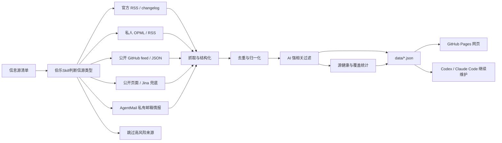

<div align="center">

# AI News Radar

## 24 小时 AI 更新雷达｜伯乐Skill

**伯乐Skill（Scout Skill）帮你从一堆信源里选出千里马。**

[](https://learnprompt.github.io/ai-news-radar/)
[](https://github.com/LearnPrompt/ai-news-radar/actions/workflows/update-news.yml)
[](LICENSE)

你只负责看更新，伯乐Skill负责从一堆信源里选出千里马；英文展示名是Scout Skill。

[在线页面](https://learnprompt.github.io/ai-news-radar/) · [English](README.en.md) · [伯乐Skill](skills/ai-news-radar/README.md) · [信息源策略](docs/SOURCE_COVERAGE.md)

</div>

---

## 这是什么

AI News Radar 是一个自动更新的 24 小时 AI 更新雷达。

普通用户直接打开网页，看最近 24 小时 AI、模型、开发者工具和技术生态更新。维护者可以 fork 这个仓库，接入自己的 OPML/RSS、公开 feed、静态页面或 AgentMail 邮箱情报。Codex / Claude Code 这类 Agent 可以使用项目内置的 **伯乐Skill**，继续帮你判断信息源、维护抓取逻辑、部署 GitHub Pages。

这个项目真正想强调的不是“又做了一个新闻网页”。

它的核心是 **伯乐Skill**：不是替你追更多信息，而是帮你从一堆信源里选出千里马。哪些源值得长期追踪，哪些源适合 RSS/OPML，哪些源只能做私有进阶源，哪些源看起来热闹但不适合进入默认雷达，先判断清楚，再接入。

> 本仓库已适配公开发布，不包含作者私有 RSS 订阅文件、API Key、cookies、邮箱正文或任何私有凭据。

## 为什么需要伯乐Skill

好新闻分散在各处，坏信息却源源不断。

官方博客发一点，GitHub changelog 发一点，X 上有人提前爆料，聚合站又把同一个新闻转来转去。你以为自己在追前沿，实际每天都在做三件事，打开几十个页面，过滤重复内容，猜哪条才值得看。

伯乐Skill先替你完成第一轮判断：哪些信源是千里马，哪些只是噪音。

它会区分哪些源适合 RSS，哪些适合 OPML，哪些可以读公开 GitHub JSON，哪些需要 Jina 兜底，哪些只能作为私有 AgentMail 情报，哪些看起来热闹但不适合放进公共默认源。

所以 AI News Radar 不是单纯把信息抓回来。

它更像一条轻量新闻 pipeline，把来源判断、抓取、去重、AI 强相关过滤、源健康状态和静态网页发布串起来。默认版本给普通读者看，进阶版本留给维护者和 Agent 继续扩展。

## 在线入口

- 公开页面，`https://learnprompt.github.io/ai-news-radar/`
- GitHub 仓库，`https://github.com/LearnPrompt/ai-news-radar`

日常阅读请打开公开页面，不需要直接打开 `data/latest-24h.json`。GitHub Actions 会每 30 分钟更新一次数据，GitHub Pages 会展示最新结果。

## 它现在能做什么

- 追踪官方 AI 节点，OpenAI News、OpenAI Codex Changelog、OpenAI Skills、Anthropic、Google DeepMind、Google AI、Hugging Face、GitHub AI 等
- 读取高信号日报和 newsletter 公开来源，例如 AI Breakfast
- 读取公开生成的 builders feed，例如 Follow Builders 的 X builders、Anthropic Engineering、Claude Blog、AI podcasts
- 接入多个公开聚合源，补足普通官方源看不到的盲区
- 支持 OPML/RSS 批量导入，私人 `feeds/follow.opml` 不进入仓库
- 支持 AgentMail 邮箱情报入口，默认关闭，只输出脱敏元数据，不读取 raw 邮件或正文
- 输出 24 小时双视图，`AI强相关` 和 `全量`
- 默认对 AI 视图去重，全量视图提供去重开关
- 显示覆盖雷达，源健康、今日覆盖池、AI 精选、官方/日报源池、Builders/X 源池、私人扩展准备度
- 显示中英双语标题和站点分组
- 显示 WaytoAGI 最近更新日和近 7 日变化
- 输出告警友好的源状态，`failed_feeds`、`zero_item_feeds`、`skipped_feeds`、`replaced_feeds`

## 工作原理



这里借鉴的是现代新闻雷达项目里最有价值的几项技术，不是简单堆信息源，而是把新闻处理拆成稳定 pipeline，抓取、去重、过滤、补充状态、生成静态站点。

但 AI News Radar 选择了一条更轻的默认路线，公开版不要求用户配置 LLM API Key，不默认依赖登录态、cookies、X API 或邮箱正文。需要这些能力时，放进进阶层，由维护者自己用 GitHub Secrets 或本地环境变量接入。

## 和 Horizon 这类项目的区别

Horizon 的 README 里有很多值得借鉴的新闻技术表达，比如多源抓取、新闻去重、AI 打分、背景补充、社区讨论、双语日报、GitHub Pages 发布、邮件和 webhook 分发。

AI News Radar 可以吸收这套“新闻雷达”的产品语言，但不能照搬能力边界。

当前项目的重点更窄，也更适合公开 fork，默认不要求 API Key，不做完整 AI 长摘要，不承诺评论区总结和邮件列表分发。它更像一个 **serverless AI 更新雷达 + 伯乐Skill**，先把 24 小时信号、源健康和可扩展路径做稳。

如果以后要继续升级，可以把 Horizon 那套能力拆成进阶路线，AI 打分、背景补充、社区评论摘要、邮件 / webhook 分发、MCP 工具化，都可以作为后续模块，但不要在 README 里写成已经完成。

## 快速开始

普通用户不用安装，直接打开在线页面即可。

想 fork 自己的版本，可以本地运行：

```bash
git clone https://github.com/LearnPrompt/ai-news-radar.git
cd ai-news-radar
python3 -m venv .venv
source .venv/bin/activate
pip install -r requirements.txt
python scripts/update_news.py --output-dir data --window-hours 24
python -m http.server 8080
```

打开：

```text
http://localhost:8080
```

如果你有自己的 OPML：

```bash
cp feeds/follow.example.opml feeds/follow.opml
# 把自己的订阅源写进 feeds/follow.opml，不要提交这个文件
python scripts/update_news.py --output-dir data --window-hours 24 --rss-opml feeds/follow.opml
```

## 给 Agent 的第一句话

如果你想让 Codex / Claude Code 帮你搭自己的版本，可以直接说：

```text
请使用伯乐Skill，先问我要信息源清单，然后帮我判断每个信源该用 RSS、OPML、公开 feed、静态页面、Jina 兜底、AgentMail 邮箱还是跳过。目标是部署一个不需要服务器、能用 GitHub Actions 自动更新的 AI 日报网站。不要把任何 API Key、cookies、token、真实 OPML、邮箱正文或私有邮件内容写入仓库。
```

项目内置 Skill 在：

- `skills/ai-news-radar/README.md`
- `skills/ai-news-radar/SKILL.md`

新 Agent 接手验收时，推荐先读：

- `README.md`
- `README.en.md`
- `docs/GPT_HANDOFF.md`
- `docs/SOURCE_COVERAGE.md`
- `docs/V2_PRODUCT_BRIEF.md`

## GitHub 自动更新

`.github/workflows/update-news.yml` 已经配置好定时任务。

- 默认每 30 分钟运行一次
- 自动生成并提交 `data/*.json`
- 如果设置 `FOLLOW_OPML_B64`，会自动解码为 `feeds/follow.opml`
- 如果设置 `EMAIL_DIGEST_ENABLED=1`、`AGENTMAIL_API_KEY`、`AGENTMAIL_INBOX_ID`，会生成脱敏邮箱摘要
- 只有额外设置 `EMAIL_DIGEST_PUBLISH=1`，才会提交 `data/email-digest.json`

默认情况下，本项目不需要任何 API Key 就能跑核心流程。

## 数据输出

- `data/latest-24h.json`
- `data/latest-24h-all.json`
- `data/archive.json`
- `data/source-status.json`
- `data/waytoagi-7d.json`
- `data/title-zh-cache.json`
- `data/email-digest.json`，可选，默认不公开提交

## 安全边界

- 不提交 `feeds/follow.opml`
- 不提交 API Key、cookies、tokens、`.env`、邮箱地址、邮箱正文或 raw 邮件
- X API、WeChat、私有 newsletter、登录态网页都属于进阶/私有层，不作为公共默认源
- AgentMail 默认关闭，只读取 MessageItem 元数据，不读取正文或 raw 邮件
- 公共仓库默认只依赖公开来源、GitHub Actions 和 GitHub Pages

## 验证命令

```bash
python3 -m venv .venv
source .venv/bin/activate
pip install -r requirements-dev.txt

python -m py_compile scripts/update_news.py
python -m pytest -q
node --check assets/app.js
git diff --check
python "${CODEX_HOME:-$HOME/.codex}/skills/.system/skill-creator/scripts/quick_validate.py" skills/ai-news-radar
```

## License

[MIT](LICENSE)
